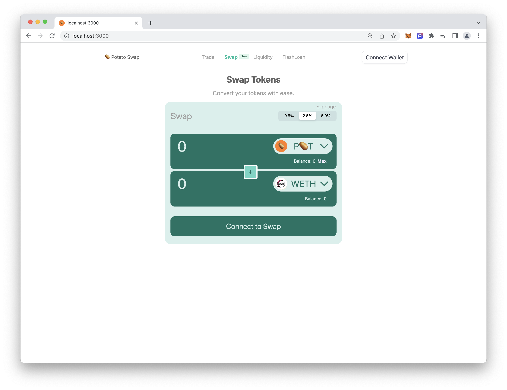

# solidity-late-final-project

```zsh
cd potatoswap-frontend
```

```zsh
yarn install
```

```zsh
yarn dev
```

## Frontend UI

- [x] Wallet Connection
- [x] Get token Balances from token contracts
- [ ] Enable Liquidity
- [ ] Aggregate swap prices


